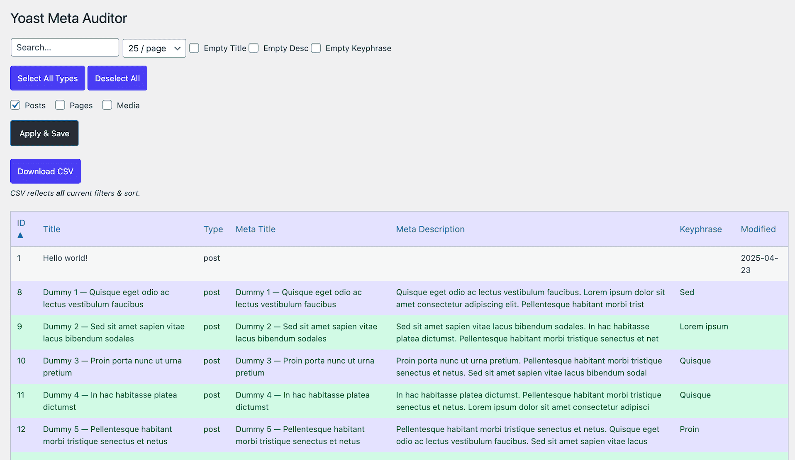

# Yoast Meta Auditor Plugin

Audit every Yoast SEO field in one place—filter, sort, paginate, **export to CSV**, and (optionally) install **WP All Import** with a single click.

---

## ✨ Features

| Feature | Details |
|---------|---------|
| **Unified filters** | Search, post-type checkboxes, per-page dropdown, plus “Empty Title / Description / Keyphrase” toggles—apply & save in one click. |
| **Column sorting** | Click any header (ID → Modified) to toggle ▲/▼. |
| **Color coding** | Rows turn 🟢 when **all** Yoast fields are filled (else zebra default). |
| **CSV export** | One-click download of *all* filtered rows—CRLF-safe for Excel/Sheets, text sanitized to avoid column bleed. |
| **WP All Import helper** | If the plugin is missing you get an “Install” button; if present you get “Start New Import”. |

---

## 🚀 Installation

1. **Download the latest release ZIP**  
   <https://github.com/abchiaravalle/ac-yoast-meta-auditor/releases/latest>

2. In WordPress admin go to **Plugins → Add New → Upload Plugin** and select the ZIP.

3. Click **Activate**.

> **PLEASE BACK UP YOUR SITE FIRST.** Install/ import at your own risk.

---

## 🔍 Usage

1. Pick your post-types, set filters, hit **Apply & Save**.  
2. Sort columns by clicking headers.  
3. **Download CSV**—contains every row that matches filters + sort.  
4. Need mass content? Install **WP All Import** straight from the tool, then click **Start New Import**.

---

## License

MIT—go wild, but **no warranty** expressed or implied.  
Always back-up before doing anything risky. 😎
